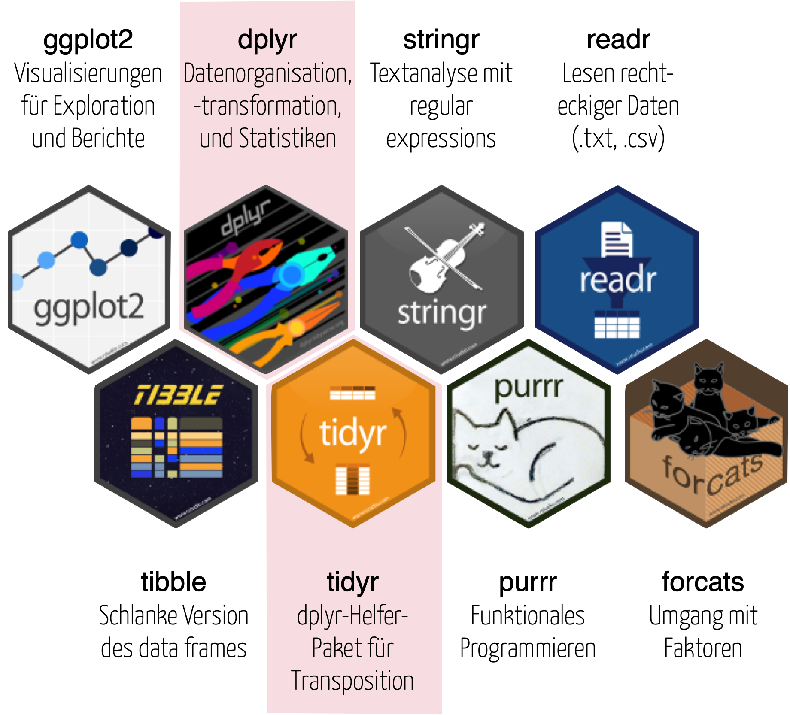
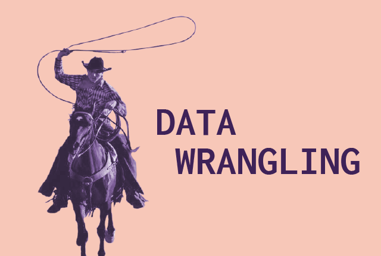
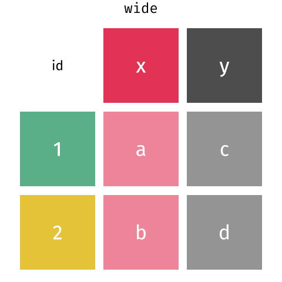
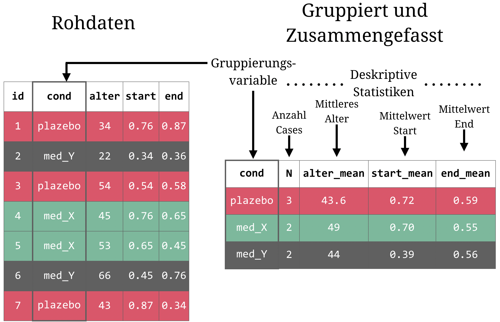

layout: true

<div class="my-footer">
  <span style="text-align:center">
    <span> 
      
    </span>
    <a href="https://therbootcamp.github.io/">
      <span style="padding-left:82px"> 
        <font color="#7E7E7E">
          www.therbootcamp.com
        </font>
      </span>
    </a>
    <a href="https://therbootcamp.github.io/">
      <font color="#7E7E7E">
       R 4 Data Science | Dezember 2022
      </font>
    </a>
    </span>
  </div> 

---
  
```{r, eval = FALSE, echo = FALSE, message=FALSE}
# Code to knit slides
xaringan::inf_mr('_sessions/D1S2_Wrangling/Wrangling.Rmd')

```

```{r setup, include=FALSE}
options(htmltools.dir.version = FALSE)
options(width=110)
options(digits = 4)
library(tidyverse)
basel <- read_csv("1_Data/basel.csv")
studie <- tibble(id = c(1, 2),
                 medikament = c("medikament", "plazebo"),
                 baseline = c(3, 4),
                 t1 = c(8, 6))

patienten <- tibble(id = c(1, 2, 3, 4, 5),
                    X1 = c(37, 65, 57, 34, 45),
                    X2 = c(1, 2, 2, 1, 2))

ergebnisse <- tibble(id = c(4, 92, 1, 2, 99),
                     t_1 = c(100, 134, 123, 143, 102),
                     t_2 = c(105, 150, 135, 140,68))
patienten_ergebnisse = patienten %>% 
  rename(alter = X1, bedingung = X2) %>%
  mutate(bed_label = case_when(
    bedingung == 1 ~ "placebo",
    bedingung == 2 ~ "medikament")) %>%
  # Verbinde mit ergebnisse
  left_join(ergebnisse, by = "id")


```


.pull-left3[

# Tidyverse

<ul>
  <li class="m1"><span>Das <mono>tidyverse</mono> ist...</span></li><br>
  <ul class="level">
    <li><span>Eine Auswahl nutzerfreundlicher <high>Pakete</high> für die Analyse von <high>tidy data</high></span></li><br>
    <li><span>Ein <high>Ökosystem</high> für Analytics und Data Science mit konsistenten Designprinzipien</span></li><br>
    <li><span>Ein <high>Dialekt</high> von R</span></li>
  </ul>
</ul>

]

.pull-right65[
<br><br>
<p align="center">

</p>
]


---

# Noch mehr <mono>dplyr</mono>

.pull-left45[


<ul>
  <li class="m1"><span><high><mono>tidyselect</mono></high></span></li>
  <ul class="level">
    <li><span>Funktionen, die das Auswählen von Variablen erleichtern.</span></li>
  </ul>
  <li class="m2"><span><high>Scoping</high></span></li>
  <ul class="level">
    <li><span>Verben auf mehrere Variablen gleichzeitig anwenden</span></li>
  </ul>
  <li class="m3"><span><high>Pivoting</high>  </span></li>
  <ul class="level">
    <li><span>Daten zu wide/long transformieren</span></li>
  </ul>
  <li class="m4"><span><high>Aggregieren</high>.</span></li>
  <ul class="level">
    <li><span>Statistiken berechnen</span></li>
  </ul>
  <li class="m5"><span><high>Gruppieren</high>.</span></li>
  <ul class="level">
    <li><span>Verben separat für Gruppen von Zeilen anwenden</span></li>
  </ul>
</ul>

]


.pull-right45[
<br>
<p align="center">
<br>
<font style="font-size:10px">from <a href="https://www.plytix.com/blog/product-information-management-best-practices">plytix.com</a></font>
</p>

]

---

# <mono>tidyselect</mono>

.pull-left4[

<ul>
  <li class="m1"><span><high>Operators</high></span></li><br>
  <ul class="level">
    <li><span><mono>:, !</mono></span></li>
  </ul><br>
  <li class="m2"><span><high>String matching</high></span></li><br>
  <ul class="level">
    <li><span><mono>starts_with(), ends_with(), contains(), matches()</mono></span></li>
  </ul><br>
  <li class="m3"><span><high>Character matching</high></span></li><br>
  <ul class="level">
    <li><span><mono>all_of(), any_of()</mono></span></li>
  </ul><br>
</ul>

]

.pull-right5[

```{r}
patienten_ergebnisse
```


]

---

# `:`

.pull-left4[

<ul>
  <li class="m1"><span><high>Operators</high></span></li><br>
  <ul class="level">
    <li><span><mono>:, !</mono></span></li>
  </ul><br>
  <li class="m2"><span><high>String matching</high></span></li><br>
  <ul class="level">
    <li><span><mono>starts_with(), ends_with(), contains(), matches()</mono></span></li>
  </ul><br>
  <li class="m3"><span><high>Character matching</high></span></li><br>
  <ul class="level">
    <li><span><mono>all_of(), any_of()</mono></span></li>
  </ul><br>
</ul>

]

.pull-right5[

```{r}
patienten_ergebnisse %>%
  
  # Spalten von alter bis t_1
  select(alter:t_1)

```

]

---

# `!`

.pull-left4[

<ul>
  <li class="m1"><span><high>Operators</high></span></li><br>
  <ul class="level">
    <li><span><mono>:, !</mono></span></li>
  </ul><br>
  <li class="m2"><span><high>String matching</high></span></li><br>
  <ul class="level">
    <li><span><mono>starts_with(), ends_with(), contains(), matches()</mono></span></li>
  </ul><br>
  <li class="m3"><span><high>Character matching</high></span></li><br>
  <ul class="level">
    <li><span><mono>all_of(), any_of()</mono></span></li>
  </ul><br>
</ul>

]

.pull-right5[

```{r}
patienten_ergebnisse %>%
  
  # Spalten ausser alter bis t_1
  select(!(alter:t_1))

```

]


---


# `starts_with()`

.pull-left4[

<ul>
  <li class="m1"><span><high>Operators</high></span></li><br>
  <ul class="level">
    <li><span><mono>:, !</mono></span></li>
  </ul><br>
  <li class="m2"><span><high>String matching</high></span></li><br>
  <ul class="level">
    <li><span><mono>starts_with(), ends_with(), contains(), matches()</mono></span></li>
  </ul><br>
  <li class="m3"><span><high>Character matching</high></span></li><br>
  <ul class="level">
    <li><span><mono>all_of(), any_of()</mono></span></li>
  </ul><br>
</ul>

]

.pull-right5[

```{r}
patienten_ergebnisse %>%
  
  # Wähle spalten aus, die mit "t" beginnen
  select(starts_with("t"))

```

]

---


# `ends_with()`

.pull-left4[

<ul>
  <li class="m1"><span><high>Operators</high></span></li><br>
  <ul class="level">
    <li><span><mono>:, !</mono></span></li>
  </ul><br>
  <li class="m2"><span><high>String matching</high></span></li><br>
  <ul class="level">
    <li><span><mono>starts_with(), ends_with(), contains(), matches()</mono></span></li>
  </ul><br>
  <li class="m3"><span><high>Character matching</high></span></li><br>
  <ul class="level">
    <li><span><mono>all_of(), any_of()</mono></span></li>
  </ul><br>
</ul>

]

.pull-right5[

```{r}
patienten_ergebnisse %>%
  
  # Wähle spalten aus, die mit "g" ended
  select(ends_with("g"))

```

]

---

# `contains()`

.pull-left4[

<ul>
  <li class="m1"><span><high>Operators</high></span></li><br>
  <ul class="level">
    <li><span><mono>:, !</mono></span></li>
  </ul><br>
  <li class="m2"><span><high>String matching</high></span></li><br>
  <ul class="level">
    <li><span><mono>starts_with(), ends_with(), contains(), matches()</mono></span></li>
  </ul><br>
  <li class="m3"><span><high>Character matching</high></span></li><br>
  <ul class="level">
    <li><span><mono>all_of(), any_of()</mono></span></li>
  </ul><br>
</ul>

]

.pull-right5[

```{r}
patienten_ergebnisse %>%
  
  # Wähle spalten aus, die "_" beinhalten
  select(contains("_"))

```

]

---

# `matches()`

.pull-left4[

<ul>
  <li class="m1"><span><high>Operators</high></span></li><br>
  <ul class="level">
    <li><span><mono>:, !</mono></span></li>
  </ul><br>
  <li class="m2"><span><high>String matching</high></span></li><br>
  <ul class="level">
    <li><span><mono>starts_with(), ends_with(), contains(), matches()</mono></span></li>
  </ul><br>
  <li class="m3"><span><high>Character matching</high></span></li><br>
  <ul class="level">
    <li><span><mono>all_of(), any_of()</mono></span></li>
  </ul><br>
</ul>

]

.pull-right5[

```{r}
patienten_ergebnisse %>%
  
  # Wähle spalten aus, die Zahlen beinhalten
  select(matches("[0-9]"))

```

]


---

# <mono>Scoping</mono>

.pull-left4[

<ul>
  <li class="m1"><span><high>Helferfunktionen</high></span></li><br>
  <ul class="level">
    <li><span><mono>across, if_any, if_all</mono></span></li>
  </ul><br>
</ul>

]

.pull-right5[

```{r}
patienten_ergebnisse
```


]

---

# <mono>across()</mono>

.pull-left4[

<ul>
  <li class="m1"><span><high>Helferfunktionen</high></span></li><br>
  <ul class="level">
    <li><span><mono>across, if_any, if_all</mono></span></li>
  </ul><br>
</ul>

]

.pull-right5[

```{r}
patienten_ergebnisse %>% 
  select(-bedingung, -bed_label) %>% 
  
  # mutate across für variablen beginnend mit t
  mutate(across(starts_with("t"), sqrt))
  
```


]

---

# <mono>across()</mono>

.pull-left4[

<ul>
  <li class="m1"><span><high>Helferfunktionen</high></span></li><br>
  <ul class="level">
    <li><span><mono>across, if_any, if_all</mono></span></li>
  </ul><br>
</ul>

]

.pull-right5[

```{r}
patienten_ergebnisse %>% 
  select(-bedingung, -bed_label) %>% 
  
  # mutate across für variablen beginnend mit t
  mutate(across(starts_with("t"), sqrt, 
                .names = "mean_{.col}"))
  
```


]


---

# <mono>if_any()</mono>

.pull-left4[

<ul>
  <li class="m1"><span><high>Helferfunktionen</high></span></li><br>
  <ul class="level">
    <li><span><mono>across, if_any, if_all</mono></span></li>
  </ul><br>
</ul>

]

.pull-right5[

```{r}
patienten_ergebnisse %>% 
  select(-bedingung, -bed_label) %>% 
  
  # mutate across für variablen beginnend mit t
  filter(if_any(starts_with("t"), ~ . < 130))
  
```


]

---

# <mono>if_all()</mono>

.pull-left4[

<ul>
  <li class="m1"><span><high>Helferfunktionen</high></span></li><br>
  <ul class="level">
    <li><span><mono>across, if_any, if_all</mono></span></li>
  </ul><br>
</ul>

]

.pull-right5[

```{r}
patienten_ergebnisse %>% 
  select(-bedingung, -bed_label) %>% 
  
  # mutate across für variablen beginnend mit t
  filter(if_all(starts_with("t"), ~ . < 130))
  
```

]

---

# <mono>Pivoting</mono>

.pull-left4[

<ul>
  <li class="m1"><span><high>Pivot-Funktionen</high></span></li><br>
  <ul class="level">
    <li><span><mono>pivot_wider() - long to wide</mono></span></li>
    <li><span><mono>pivot_longer() - wide to long</mono></span></li>

  </ul><br>
</ul>

]

.pull-right5[

<p align="center">
<br>
<font style="font-size:10px">adapted from <a href="https://github.com/gadenbuie/tidyexplain">tidyexplain</a></font>
</p>

]

---

# <mono>Pivoting</mono>

.pull-left4[

<ul>
  <li class="m1"><span><high>Pivot-Funktionen</high></span></li><br>
  <ul class="level">
    <li><span><mono>pivot_wider() - long to wide</mono></span></li>
    <li><span><mono>pivot_longer() - wide to long</mono></span></li>

  </ul><br>
</ul>

]

.pull-right5[

```{r}
patienten_ergebnisse
```


]

---

# `pivot_longer()`

.pull-left4[

```{r, eval = F}
# wide zu long
TIBBLE %>% 
  pivot_longer(cols = VARS,
               names_to = NAME1,
               values_to = NAME2)
```

]

.pull-right5[

```{r}
# wide zu long
patienten_ergebnisse %>% 
  filter(bed_label == "placebo")

```
]

---

# `pivot_longer()`

.pull-left4[

```{r, eval = F}
# wide zu long
TIBBLE %>% 
  pivot_longer(cols = VARS,
               names_to = NAME1,
               values_to = NAME2)
```

]

.pull-right5[

```{r}
# wide zu long
patienten_ergebnisse %>% 
  filter(bed_label == "placebo") %>%
  pivot_longer(cols = c("t_1", "t_2"),
               names_to = "zeit",
               values_to = "messung")
```

]

---


# `pivot_wider()`

.pull-left4[

```{r, eval = F}
# wide zu long
TIBBLE %>% 
  pivot_wider(names_from = VAR1,
              values_from = VAR2)
```
]

.pull-right5[

```{r, echo = FALSE}
# wide zu long
patienten_ergebnisse_lang <- patienten_ergebnisse %>% 
  filter(bed_label == "placebo") %>%
  pivot_longer(cols = c("t_1", "t_2"),
               names_to = "zeit",
               values_to = "messung")
```

```{r}
# wide zu long
patienten_ergebnisse_lang
```

]

---


# `pivot_wider()`

.pull-left4[

```{r, eval = F}
# wide zu long
TIBBLE %>% 
  pivot_wider(names_from = VAR1,
              values_from = VAR2)
```
]

.pull-right5[

```{r, echo = FALSE}
# wide zu long
patienten_ergebnisse_lang <- patienten_ergebnisse %>% 
  filter(bed_label == "placebo") %>%
  pivot_longer(cols = c("t_1", "t_2"),
               names_to = "zeit",
               values_to = "messung")
```

```{r}
# wide zu long
patienten_ergebnisse_lang %>%
    pivot_wider(names_from = "zeit",
                values_from = "messung")
```

]


---

# Aggregation

.pull-left4[

<ul>
  <li class="m1"><span><high>Aggregation</high>
  <br><br>
  <ul class="level">
    <li><span><mono>summarise()</mono></span></li>
    <li><span><mono>n(), first(), last(), nth()</mono></span></li>
    <li><span><mono>pull()</mono></span></li>
  </ul>
  </span></li>
</ul>

]

.pull-right5[

```{r, echo=F}
options(tibble.width=40, tibble.print_max=5, tibble.print_min=5, tibble.max_extra_cols=10)
```

```{r}
patienten_ergebnisse
```


]


---

# `summarise()`

.pull-left4[


```{r, echo = TRUE, eval = FALSE}
TIBBLE %>%
  summarise(
    NAME1 = SUMMARY_FUN(VAR1),
    NAME2 = SUMMARY_FUN(VAR2)
  )
```


]

.pull-right5[

```{r}
patienten_ergebnisse %>%
  
  # Berechne deskriptive Statistiken
  summarise(
    alter_mean = mean(alter),
    alter_median = median(alter)
  )
```


]

---

# `summarise()`

.pull-left4[


```{r, echo = TRUE, eval = FALSE}
TIBBLE %>%
  summarise(
    NAME1 = SUMMARY_FUN(VAR1),
    NAME2 = SUMMARY_FUN(VAR2)
  )
```


]

.pull-right5[

```{r}
patienten_ergebnisse %>%
  
  # Berechne deskriptive Statistiken
  summarise(
    first_val = first(alter),
    last_val = last(alter),
    nth_val = nth(alter, 3),
    n = n()
  )
```


]


---

# Gruppieren

<p align="center">
  
</p> 


---

# `group_by()` + `summarise()`

.pull-left4[

```{r, eval = F}
TIBBLE %>%
  group_by(GRUPPEN_VAR) %>%
  summarise(
    NAME1 = SUMMARY_FUN(VAR1),
    NAME2 = SUMMARY_FUN(VAR2)
  )
```


]

.pull-right5[

```{r}
patienten_ergebnisse %>%
  
  # Gruppiere nach Bedingung
  group_by(bed_label) %>%
  
  # Berechne Statistiken
  summarise(
    alter_mean = mean(alter),
    alter_median = median(alter)
  )
```

]

---

# `group_by()` + `mutate()`

.pull-left4[

```{r, eval = F}
TIBBLE %>%
  group_by(GRUPPEN_VAR) %>%
  mutate(
    NAME1 = MUTATE_FUN(VAR1),
    NAME2 = MUTATE_FUN(VAR2)
  )
```


]

.pull-right5[

```{r}
patienten_ergebnisse %>%
  select(-c(t_1, t_2)) %>% 
  
  # Gruppiere nach geschlecht
  group_by(bed_label) %>%
  
  # Variablen mutieren
  mutate(below_med = alter < median(alter)) 
```

]


---

class: middle, center

<h1><a href="https://therbootcamp.github.io/R4DS_2022CSS/_sessions/WranglingII/WranglingII_practical.html">Practical</a></h1>
